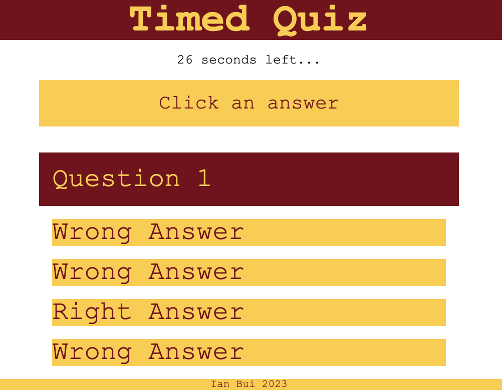

# umn-edx-timed-quiz

## SUMMARY
This is a basic timed quiz where, after the "Begin Quiz" button is pressed, the player is presented with a series of questions that must be answered in the time alloted.  A correct response adds a point to the total score while an incorrect response incurs a time penalty.  Once the final question is completed or time has expired, the player will be prompted to enter his/her/their initials to be added to the high score leaderboard.  The leaderboard is then shown.

## NOTES
This is actually an impractical implementation of a quiz in that all the data is easily accessible from the browser console and that the scores are stored in the browser's storage.  Ideally these would all be encrypted and would involve calls with a server that serves the question text and processes responses, but the intent of this assignment was to explore certain in-browser JS features such as timers, event listeners, and storage.

Initally I believed the high score leaderboard size was meant to be capped and started coding that to ensure the lowest score(s) would be removed if the leaderboard ever exceeded the max size.  I ultimately removed the code during doublechecking of the requirements while still pending was a check whether the current player's final score was high enough to bump a previous score.

Although the requirements didn't explicitly say that initials must be letters, they did seem to imply that, so I added validation to ensure that what's entered is 1-3 letters and nothing else.  The only good way I could think of achieving that was with regular expressions.  I also set the code to upcase the letters so they are consistent.

## LIVE VIEW
This quiz can be viewed here: https://thinkbui.github.io/umn-edx-timed-quiz/

